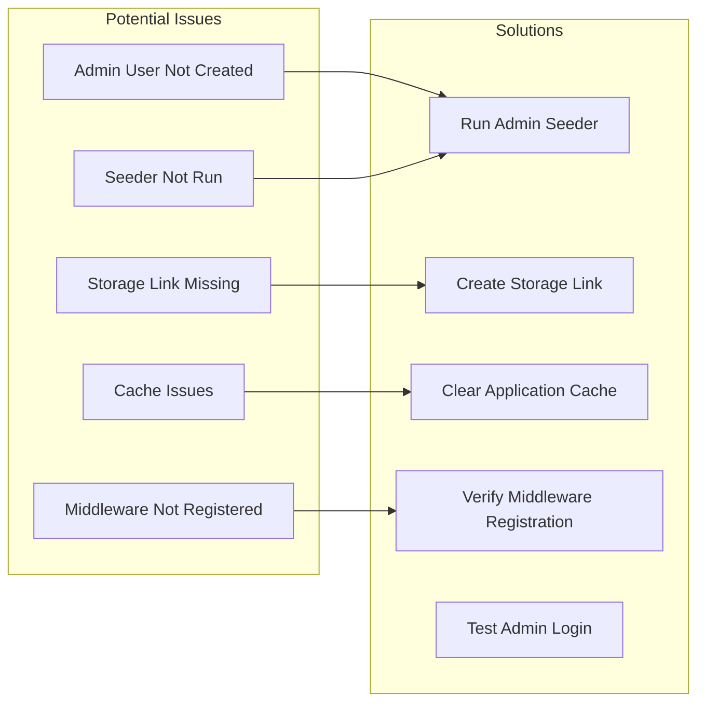

# Design Document - Admin Access Fix

## Overview

Perbaikan akses admin untuk website e-commerce McDonald's yang sudah memiliki implementasi lengkap namun mengalami masalah akses. Sistem sudah memiliki semua komponen yang diperlukan (controllers, views, middleware, routes) namun kemungkinan ada masalah dalam setup database, seeder, atau konfigurasi. Solusi akan fokus pada verifikasi dan perbaikan setup yang ada tanpa mengubah implementasi core.

## Architecture

### Current System Architecture

```mermaid
graph TB
    subgraph "Authentication Layer"
        Login[Login System]
        AdminMiddleware[Admin Middleware]
        UserModel[User Model with isAdmin()]
    end
    
    subgraph "Admin Controllers (Already Implemented)"
        DashboardController[Dashboard Controller]
        ProductController[Product Controller]
        MessageController[Message Controller]
        OrderController[Order Controller]
        UserController[User Controller]
        ReportController[Report Controller]
    end
    
    subgraph "Admin Views (Already Implemented)"
        AdminLayout[Admin Layout]
        ProductViews[Product CRUD Views]
        MessageViews[Message Management Views]
        DashboardView[Dashboard View]
    end
    
    subgraph "Database Layer"
        UserTable[Users Table with role column]
        ProductTable[Products Table]
        MessageTable[Contact Messages Table]
        Seeders[Database Seeders]
    end
    
    Login --> AdminMiddleware
    AdminMiddleware --> UserModel
    UserModel --> AdminControllers
    AdminControllers --> AdminViews
    AdminControllers --> Database
```

### Problem Areas Identified



## Components and Interfaces

### Existing Components (Already Implemented)

| Component | Status | Description |
|-----------|--------|-------------|
| AdminMiddleware | ✅ Implemented | Checks user role and blocks non-admin access |
| Admin\ProductController | ✅ Implemented | Full CRUD operations for products |
| Admin\MessageController | ✅ Implemented | Message management with read/unread status |
| Admin\DashboardController | ✅ Implemented | Dashboard with metrics and navigation |
| Admin Layout | ✅ Implemented | Sidebar navigation and admin styling |
| Admin Routes | ✅ Implemented | All admin routes properly defined |
| User Model | ✅ Implemented | isAdmin() method for role checking |

### Components to Verify/Fix

| Component | Action Required | Description |
|-----------|----------------|-------------|
| AdminUserSeeder | ✅ Run Seeder | Create admin user in database |
| Storage Link | ✅ Create Link | Enable image uploads and display |
| Database Migration | ✅ Verify | Ensure all tables exist |
| Application Cache | ✅ Clear | Remove cached configurations |
| Middleware Registration | ✅ Verify | Ensure admin middleware is registered |

## Data Models

### User Model Structure (Already Correct)

```php
// User model already has correct structure
class User extends Authenticatable
{
    protected $fillable = [
        'name', 'email', 'password', 'phone', 'address', 'role'
    ];
    
    public function isAdmin(): bool
    {
        return $this->role === 'admin';
    }
}
```

### Database Schema Verification

The following tables should exist and be properly structured:

- `users` table with `role` column (enum: 'user', 'admin')
- `products` table with all product fields
- `contact_messages` table with `is_read` column
- All other e-commerce related tables

## Correctness Properties

*A property is a characteristic or behavior that should hold true across all valid executions of a system-essentially, a formal statement about what the system should do. Properties serve as the bridge between human-readable specifications and machine-verifiable correctness guarantees.*

### Property 1: Admin Route Protection
*For any* admin route and any non-admin user, attempting to access the route should result in a 403 Unauthorized error
**Validates: Requirements 1.3**

### Property 2: Admin Navigation Functionality
*For any* admin navigation link, clicking it should display the corresponding admin page without errors
**Validates: Requirements 1.5**

### Property 3: Message Filtering Accuracy
*For any* message status filter applied, the displayed messages should only include messages matching the selected status
**Validates: Requirements 3.4**

### Property 4: Message Search Accuracy
*For any* search term entered, the displayed messages should only include messages that contain the search term in name, email, or subject
**Validates: Requirements 3.5**

### Property 5: Admin Middleware Protection
*For any* route protected by admin middleware, access should be denied to users without admin role
**Validates: Requirements 4.5**

### Property 6: Navigation State Management
*For any* admin page visited, the corresponding navigation item should be highlighted as active
**Validates: Requirements 5.2**

### Property 7: Admin Action Feedback
*For any* admin action performed (create, update, delete), the system should display appropriate success or error messages
**Validates: Requirements 5.3**

## Error Handling

### Admin Access Errors

| Error Type | Handling Strategy |
|------------|-------------------|
| Non-admin Access | Display 403 Unauthorized page with clear message |
| Invalid Admin Credentials | Display login error and redirect to login page |
| Missing Admin User | Provide instructions to run admin seeder |
| Database Connection Error | Display error page with troubleshooting steps |
| Storage Permission Error | Display error with file permission instructions |

### Setup Verification Errors

| Error Type | Handling Strategy |
|------------|-------------------|
| Missing Tables | Run database migrations |
| Missing Admin User | Run admin user seeder |
| Missing Storage Link | Create storage symbolic link |
| Cache Issues | Clear application cache |
| Middleware Not Registered | Verify middleware registration in Kernel |

## Testing Strategy

### Unit Testing

Unit tests akan menggunakan PHPUnit untuk menguji:
- AdminMiddleware functionality
- User model isAdmin() method
- Admin controller access control
- Database seeder functionality

### Integration Testing

Integration tests akan menguji:
- Complete admin login flow
- Admin CRUD operations end-to-end
- Message management workflow
- File upload and storage functionality

### Manual Verification Steps

1. **Database Setup Verification**
   - Run `php artisan migrate` to ensure all tables exist
   - Run `php artisan db:seed --class=AdminUserSeeder` to create admin user
   - Verify admin user exists in database with correct role

2. **Storage Setup Verification**
   - Run `php artisan storage:link` to create storage symbolic link
   - Test image upload functionality
   - Verify images display correctly

3. **Admin Access Verification**
   - Login with admin credentials (admin@mcd.com / admin123)
   - Verify redirect to admin dashboard
   - Test all admin navigation links
   - Verify non-admin users cannot access admin routes

4. **Admin Functionality Verification**
   - Test product CRUD operations
   - Test message management features
   - Verify all admin pages load correctly
   - Test logout functionality

### Property-Based Testing

Property-based testing akan menggunakan **eris/eris** library untuk PHP. Setiap property test akan:
- Menjalankan minimal 100 iterasi
- Di-tag dengan format: `**Feature: admin-access-fix, Property {number}: {property_text}**`
- Menggunakan generators untuk membuat random test data

### Test Structure

```
tests/
├── Unit/
│   ├── AdminMiddlewareTest.php
│   ├── UserModelTest.php
│   └── AdminSeederTest.php
├── Feature/
│   ├── AdminLoginTest.php
│   ├── AdminProductManagementTest.php
│   ├── AdminMessageManagementTest.php
│   └── AdminAccessControlTest.php
└── Property/
    ├── AdminRouteProtectionPropertyTest.php
    ├── AdminNavigationPropertyTest.php
    └── MessageFilteringPropertyTest.php
```
