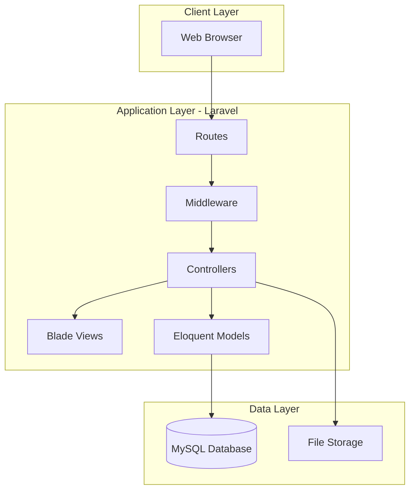
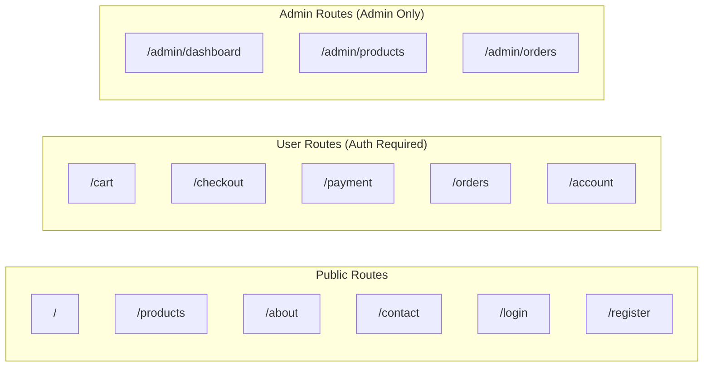
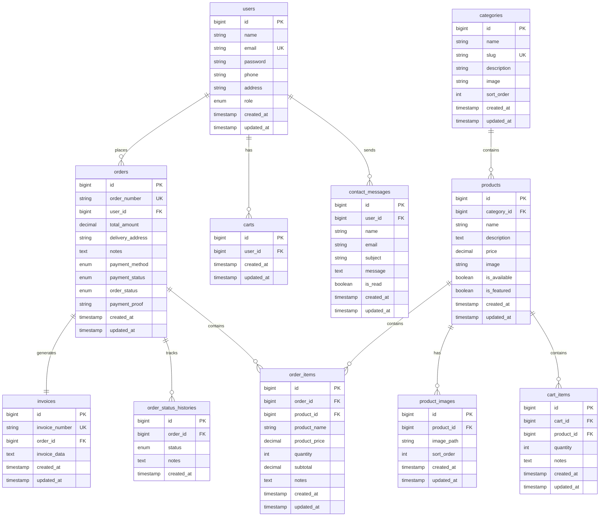

# Design Document - McD E-Commerce Website

## Overview

Website e-commerce McDonald's (McD) dibangun menggunakan Laravel framework dengan arsitektur MVC (Model-View-Controller). Sistem ini memiliki dua area utama: User Area untuk pelanggan dan Admin Area untuk pengelola. Website menggunakan Blade templating untuk frontend, MySQL untuk database, dan Laravel's built-in authentication untuk manajemen user.

## Architecture

### High-Level Architecture



### Route Structure



## Components and Interfaces

### Controllers

#### User Controllers

| Controller | Methods | Description |
|------------|---------|-------------|
| HomeController | index() | Display home page with featured products |
| ProductController | index(), show(), search() | Display product catalog and details |
| CartController | index(), add(), update(), remove() | Manage shopping cart |
| CheckoutController | index(), store() | Handle checkout process |
| PaymentController | index(), store(), uploadProof() | Handle payment and proof upload |
| OrderController | index(), show() | Display user orders |
| AccountController | index(), update() | Manage user account |
| ContactController | index(), store() | Handle contact form |
| AboutController | index() | Display about page |

#### Admin Controllers

| Controller | Methods | Description |
|------------|---------|-------------|
| Admin\DashboardController | index() | Display admin dashboard |
| Admin\ProductController | index(), create(), store(), edit(), update(), destroy(), toggleAvailability() | CRUD products |
| Admin\OrderController | index(), show(), updateStatus() | Manage orders |
| Admin\InvoiceController | show(), print() | Generate invoices |
| Admin\UserController | index(), show() | View registered users |
| Admin\MessageController | index(), show(), markAsRead() | Manage contact messages |
| Admin\ReportController | index(), sales() | View sales reports |

### Middleware

| Middleware | Purpose |
|------------|---------|
| auth | Ensure user is authenticated |
| guest | Ensure user is not authenticated |
| admin | Ensure user has admin role |

### Services

| Service | Methods | Description |
|---------|---------|-------------|
| CartService | getCart(), addItem(), updateQuantity(), removeItem(), clearCart(), getTotal() | Cart business logic |
| OrderService | createOrder(), updateStatus(), getOrdersByUser(), getOrderById() | Order business logic |
| InvoiceService | generateInvoice(), getInvoiceData() | Invoice generation |
| PaymentService | processPayment(), uploadProof(), verifyPayment() | Payment handling |
| EmailService | sendOrderConfirmation(), sendStatusUpdate() | Email notifications |
| ReportService | getSalesReport(), getTopProducts(), getDailySales() | Sales reporting |

## Data Models

### Entity Relationship Diagram



### Enum Values

| Enum | Values |
|------|--------|
| user.role | user, admin |
| order.payment_method | cod, transfer_bank |
| order.payment_status | pending, paid, failed |
| order.order_status | pending, confirmed, processing, completed, cancelled |


## Correctness Properties

*A property is a characteristic or behavior that should hold true across all valid executions of a system-essentially, a formal statement about what the system should do. Properties serve as the bridge between human-readable specifications and machine-verifiable correctness guarantees.*


### Property 1: User Registration Creates Account
*For any* valid registration data (email, password, name, phone), submitting the registration form should result in a new user record in the database with matching information.
**Validates: Requirements 1.1**

### Property 2: Authentication with Valid Credentials
*For any* registered user with valid credentials, submitting the login form should result in an authenticated session.
**Validates: Requirements 1.3**

### Property 3: Product Catalog Completeness
*For any* set of available products in the database, the product page should display all products with their name, description, price, and image.
**Validates: Requirements 2.1, 2.2**

### Property 4: Product Search Returns Matching Results
*For any* search term, the search results should only contain products whose name contains the search term.
**Validates: Requirements 2.4**

### Property 5: Add to Cart Increases Quantity
*For any* available product, adding it to cart should either create a new cart item with quantity 1, or increment existing item quantity by 1.
**Validates: Requirements 3.1, 3.2**

### Property 6: Cart Calculation Consistency
*For any* cart with items, the subtotal of each item should equal price × quantity, and the total should equal the sum of all subtotals.
**Validates: Requirements 3.3, 3.5**

### Property 7: Remove from Cart Deletes Item
*For any* item in cart, removing it should result in the item no longer being present in the cart.
**Validates: Requirements 3.6**

### Property 8: Checkout Total Matches Cart
*For any* cart proceeding to checkout, the checkout total amount should equal the cart total.
**Validates: Requirements 4.1**

### Property 9: Order Preserves Delivery Information
*For any* checkout submission with delivery address and notes, the created order should contain the exact same delivery information.
**Validates: Requirements 4.2**

### Property 10: COD Order Initial Status
*For any* order created with COD payment method, the order should have payment_status "pending" and order_status "pending".
**Validates: Requirements 4.3**

### Property 11: Payment Proof Association
*For any* uploaded payment proof image, the image should be saved and correctly associated with the corresponding order.
**Validates: Requirements 4.5**

### Property 12: Unique Invoice Number Generation
*For any* successfully created order, an invoice with a unique invoice number should be generated.
**Validates: Requirements 4.6**

### Property 13: User Orders List Completeness
*For any* user, the orders list should display all orders belonging to that user.
**Validates: Requirements 5.1**

### Property 14: Order Status Change Persistence
*For any* order status update, the new status should be persisted and reflected in the order detail.
**Validates: Requirements 5.3**

### Property 15: Product CRUD Operations
*For any* product data, creating a product should add it to catalog, editing should update it, toggling availability should change status, and deleting should remove it from catalog.
**Validates: Requirements 6.2, 6.3, 6.4, 6.5**

### Property 16: Admin Order Status Update with Timestamp
*For any* admin order status update, the new status should be saved with a recorded timestamp.
**Validates: Requirements 7.4**

### Property 17: Order Filter by Status
*For any* status filter applied, the filtered order list should only contain orders with the matching status.
**Validates: Requirements 7.5**

### Property 18: Invoice Content Completeness
*For any* generated invoice, it should contain order number, date, customer information, item details, quantities, prices, subtotals, total amount, and payment method.
**Validates: Requirements 8.1**

### Property 19: Contact Form Message Persistence
*For any* contact form submission, the message should be saved in the database.
**Validates: Requirements 9.4**

### Property 20: Dashboard Metrics Accuracy
*For any* set of orders in the database, the dashboard should display accurate total orders count, total revenue, pending orders count, orders grouped by status, and today's orders/revenue filtered correctly.
**Validates: Requirements 10.1, 10.2, 10.3**

### Property 21: Category Filter Returns Correct Products
*For any* category filter applied, the product list should only contain products belonging to that category.
**Validates: Requirements 11.2**

### Property 22: Order Cancellation Updates Status
*For any* order with status "pending", cancelling it should update the status to "cancelled" and record the timestamp.
**Validates: Requirements 12.2**

### Property 23: Featured Products Display
*For any* product marked as featured, it should appear in the featured products section on the home page.
**Validates: Requirements 19.2**

### Property 24: Sales Report Date Range Filter
*For any* date range filter applied, the sales report should only include orders within that date range.
**Validates: Requirements 20.2**

### Property 25: Contact Message Read Status
*For any* contact message marked as read, the is_read status should be persisted in the database.
**Validates: Requirements 16.2**

## Error Handling

### User-Facing Errors

| Error Type | Handling Strategy |
|------------|-------------------|
| Validation Errors | Display field-specific error messages using Laravel validation |
| Authentication Errors | Display generic "Invalid credentials" message |
| Cart Errors | Display toast notification for cart operations |
| Payment Errors | Display error message and allow retry |
| File Upload Errors | Display error message with file requirements |
| 404 Not Found | Display custom 404 page |
| 500 Server Error | Display custom error page, log error details |

### Admin-Facing Errors

| Error Type | Handling Strategy |
|------------|-------------------|
| Product CRUD Errors | Display specific error message with details |
| Order Update Errors | Display error and maintain current state |
| File Access Errors | Display error with file path information |

### Validation Rules

| Entity | Field | Rules |
|--------|-------|-------|
| User | email | required, email, unique |
| User | password | required, min:8 |
| User | name | required, string, max:255 |
| User | phone | required, string, max:20 |
| Product | name | required, string, max:255 |
| Product | price | required, numeric, min:0 |
| Product | image | required, image, max:2MB |
| Order | delivery_address | required, string |
| Order | payment_method | required, in:cod,transfer_bank |
| Payment Proof | image | required, image, max:5MB |

## Testing Strategy

### Unit Testing

Unit tests akan dibuat menggunakan PHPUnit (built-in Laravel) untuk menguji:
- Model relationships dan methods
- Service class methods
- Validation rules
- Helper functions

### Property-Based Testing

Property-based testing akan menggunakan **eris/eris** library untuk PHP. Setiap property test akan:
- Menjalankan minimal 100 iterasi
- Di-tag dengan format: `**Feature: restaurant-ecommerce, Property {number}: {property_text}**`
- Menggunakan generators untuk membuat random valid data

### Integration Testing

Integration tests akan menguji:
- Full request/response cycles
- Database transactions
- File uploads
- Authentication flows

### Test Structure

```
tests/
├── Unit/
│   ├── Models/
│   │   ├── UserTest.php
│   │   ├── ProductTest.php
│   │   ├── CartTest.php
│   │   ├── OrderTest.php
│   │   └── InvoiceTest.php
│   └── Services/
│       ├── CartServiceTest.php
│       ├── OrderServiceTest.php
│       └── InvoiceServiceTest.php
├── Feature/
│   ├── Auth/
│   │   ├── RegistrationTest.php
│   │   └── LoginTest.php
│   ├── User/
│   │   ├── ProductTest.php
│   │   ├── CartTest.php
│   │   ├── CheckoutTest.php
│   │   └── OrderTest.php
│   └── Admin/
│       ├── DashboardTest.php
│       ├── ProductManagementTest.php
│       └── OrderManagementTest.php
└── Property/
    ├── CartCalculationPropertyTest.php
    ├── OrderCreationPropertyTest.php
    ├── SearchPropertyTest.php
    └── DashboardMetricsPropertyTest.php
```
