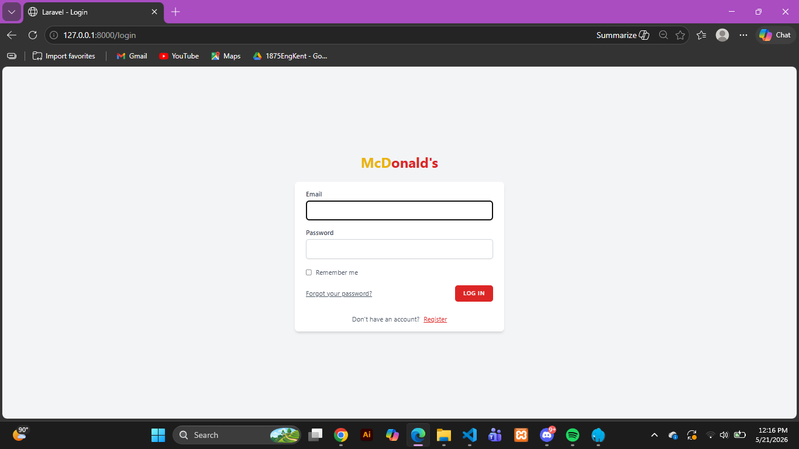
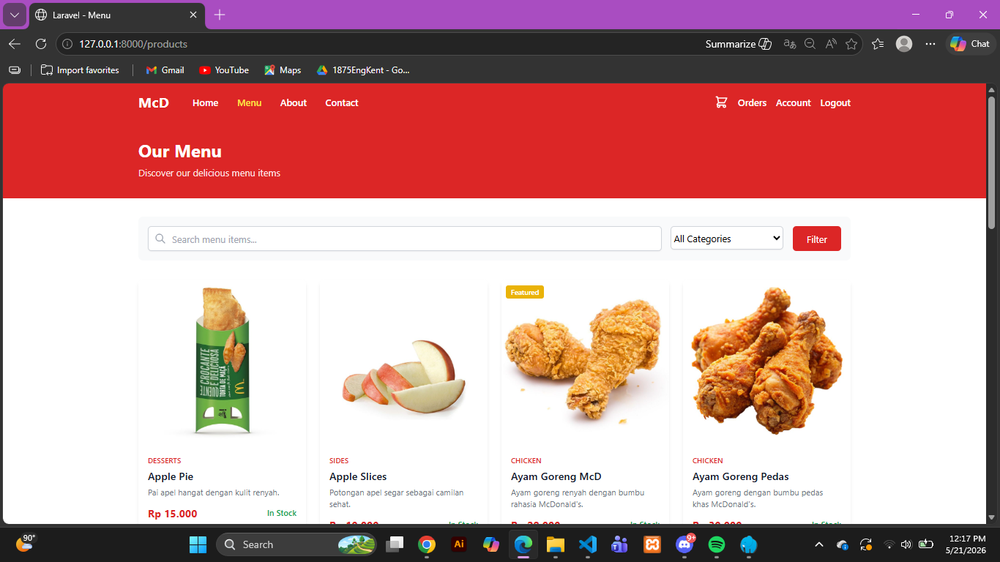
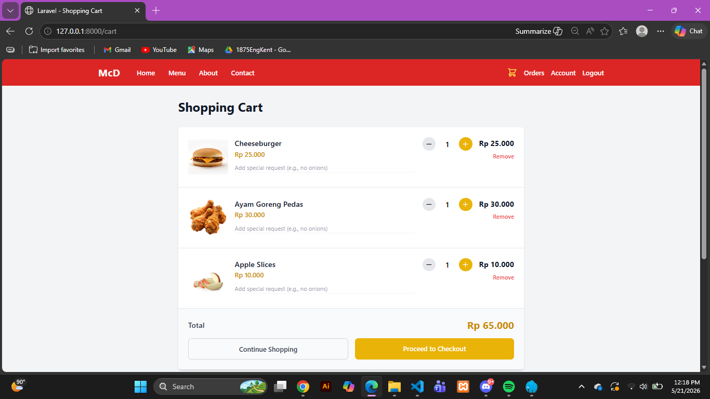
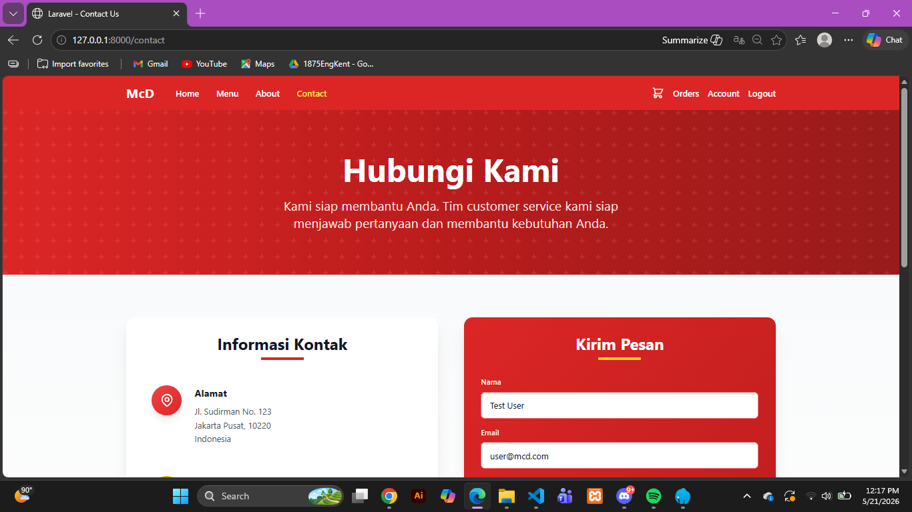
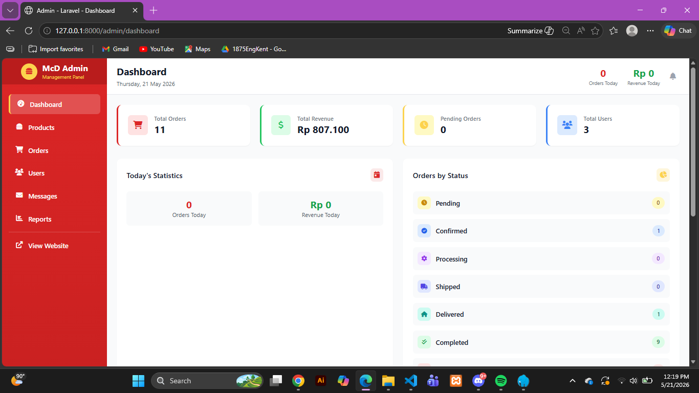
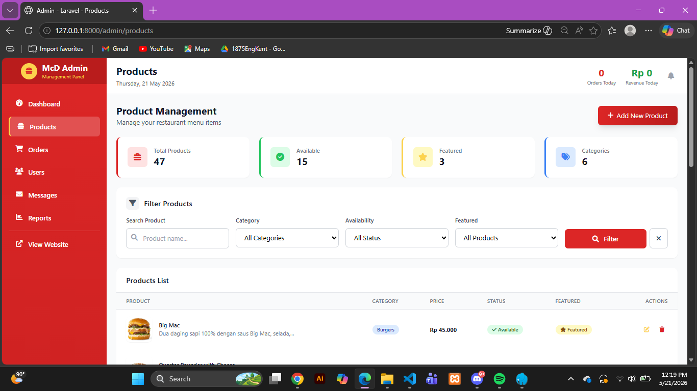
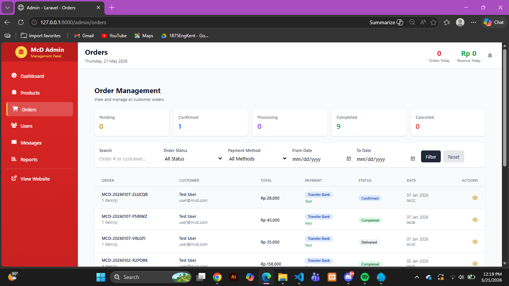
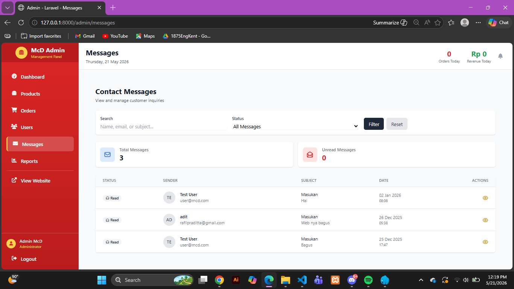
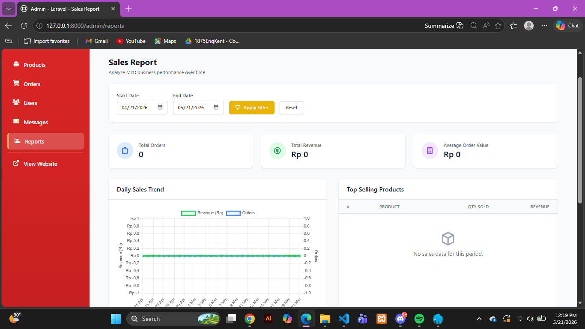

# McD Restaurant E-Commerce

McD Restaurant E-Commerce is a web-based restaurant ordering application built using Laravel.  
This project was created as a Semester 3 Final Semester Exam (UAS) project and provides complete restaurant management features for both users and administrators.

---

## 🚀 Features

### User Features
- User Authentication & Registration
- Browse Food & Beverage Products
- Product Categories
- Shopping Cart System
- Checkout & Payment
- Order History
- Responsive User Interface

### Admin Features
- Admin Dashboard
- Manage Products
- Manage Categories
- Manage Orders
- Manage Users
- Product Image Upload
- Sales & Order Monitoring

---

## 🛠 Tech Stack

- Backend : PHP & Laravel
- Frontend : Laravel Blade, Bootstrap / Tailwind CSS
- Database : MySQL
- Tools : Laragon, Composer, Git & GitHub

---

## 📦 Installation Guide

### 1. Clone Repository
```bash
git clone https://github.com/USERNAME/REPOSITORY_NAME.git
```

### 2. Open Project Folder
```bash
cd REPOSITORY_NAME
```

### 3. Install Dependencies
```bash
composer install
```

### 4. Copy Environment File
```bash
cp .env.example .env
```

### 5. Generate Application Key
```bash
php artisan key:generate
```

### 6. Create Database
Create a new MySQL database.

### 7. Import Database
Import the SQL file located in:

```txt
/database/e-commerce_mcd.sql
```

### 8. Configure Database
Edit the `.env` file and configure your database settings:

```env
DB_DATABASE=your_database_name
DB_USERNAME=root
DB_PASSWORD=
```

### 9. Run Development Server
```bash
php artisan serve
```

### 10. Open in Browser
```txt
http://127.0.0.1:8000
```

---

## 📁 Project Structure

```txt
app/            -> Application logic
resources/      -> Blade templates and UI
routes/         -> Application routes
database/       -> SQL database files
public/         -> Public assets
```

---

## 📸 Screenshots

### Login Page


### Menu Page


### Cart Page


### Contact Page


### Admin Page


### Admin Products Page


### Admin Orders Page


### Admin Message Page


### Admin Reports Page


---

## 📌 Notes

Make sure:
- Laragon / XAMPP is running
- PHP and Composer are installed
- Database has been imported before running the project

---

## 👨‍💻 Developer

Developed as a Semester 3 Final Semester Exam (UAS) project for learning purposes.

---